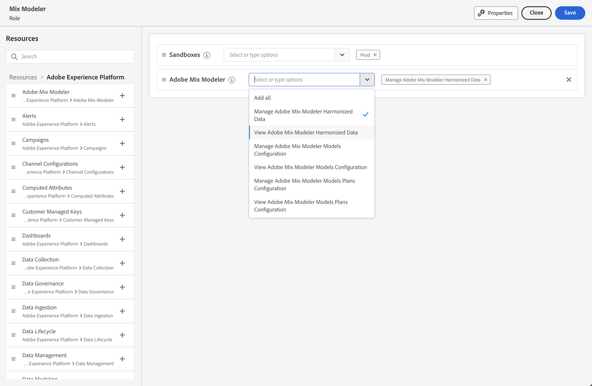

# Amministrazione

Utilizza il [Adobe Admin Console](https://helpx.adobe.com/it/enterprise/using/admin-console.html) per gestire prodotti e utenti Mix Modeler.

Affinché Mix Modeler funzioni correttamente, devi impostare le autorizzazioni corrette.

Nell’interfaccia utente di Adobe Experience Cloud:

1. Seleziona **[!UICONTROL Permissions]** dalla barra a sinistra, sotto **[!UICONTROL ADMINISTRATION]**.

1. Seleziona  **[!UICONTROL Roles]** dal pannello a sinistra.

1. Seleziona un ruolo esistente o creane uno esistente utilizzando **[!UICONTROL Create role]** (ad esempio, **Mix Modeler**). Se si seleziona un ruolo esistente, selezionare  **[!UICONTROL Edit]** per modificare le autorizzazioni per il ruolo. Consulta [Gestisci ruoli](https://helpx.adobe.com/it/enterprise/using/admin-console.html) per ulteriori informazioni.

1. Verifica di aver selezionato una o più sandbox per il ruolo.

1. Aggiungi il **Adobe Mix Modeler** risorsa all&#39;elenco delle risorse per il ruolo.

1. Accertati di selezionare la **[!UICONTROL Adobe Mix Modeler]** autorizzazioni per il ruolo che si sta configurando. Puoi selezionare uno o più dei seguenti ruoli:

   - **[!UICONTROL View Adobe Mix Modeler Harmonized Data]**
   - **[!UICONTROL Manage Adobe Mix Modeler Harmonized Data]**
   - **[!UICONTROL View Adobe Mix Modeler Models Configuration]**
   - **[!UICONTROL Manage Adobe Mix Modeler Models Configuration]**
   - **[!UICONTROL View Adobe Mix Modeler Plans Configuration]**
   - **[!UICONTROL Manage Adobe Mix Modeler Plans Configuration]**

     

1. Accertati di selezionare le autorizzazioni aggiuntive per il ruolo. Ad esempio, per visualizzare o gestire set di dati e schemi, seleziona:

   - **[!UICONTROL Data Management]**: seleziona le opzioni pertinenti: **[!UICONTROL View Datasets]** o **[!UICONTROL Manage Datasets]**.

   - **[!UICONTROL Data Modeling]**: seleziona le opzioni pertinenti: **[!UICONTROL Manage Schemas]** o **[!UICONTROL View Schemas]**.

   <!--
    * **[!UICONTROL Data Governance]**: ensure you select **[!UICONTROL View User Activity Log]** and **[!UICONTROL View Data Usage Policies]**.
    -->

   <!---->

   Seleziona **[!UICONTROL Save]** per salvare le autorizzazioni.

1. In entrata **[!UICONTROL Details]** entro **[!UICONTROL Role]**, aggiungi il **[!UICONTROL Users]** o **[!UICONTROL User groups]** per fornire agli utenti l’accesso a Mix Modeler.
