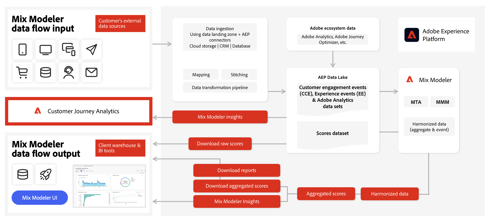

# Flusso di lavoro di Mix Modeler

Guarda questo video per un’introduzione al flusso di lavoro degli utenti in Mix Modeler.

>[!VIDEO](https://video.tv.adobe.com/v/3424854/?learn=on)

Un flusso di lavoro tipico in Mix Modeler è costituito dalle seguenti attività:

|  | Attività | Descrizione |
|---|---|---|
| {width="100"} | [**Acquisire dati**](../ingest-data/overview.md) | Acquisisci dati evento da Experience Platform (ad esempio Adobe Analytics, Web SDK, altre origini), dati aggregati dai canali di marketing (ad esempio TV, giardini murati, e-mail, attività possedute e gestite), dati di fattori esterni dai clienti (ad esempio le variazioni di prezzo nel servizio di abbonamento) e dati di fattori interni (ad esempio i piani delle feste). |
| {width="100"} | [**Armonizzare i dati**](../harmonize-data/overview.md) | Configura le regole di mappatura e di risoluzione dei conflitti per unire i vari set di dati di marketing necessari per misurare e pianificare le prestazioni della campagna in Mix Modeler. |
| {width="100"} | [**Modelli di compilazione**](../models/overview.md) | Crea istanze di modello con punti di contatto di marketing (ad esempio canali), definizioni di conversione e fattori interni ed esterni. |
| {width="100"} | [**Formazione e valutazione dei modelli**](../models/overview.md) | Crea punteggi aggregati e a livello di evento utilizzando l’apprendimento automatico e il punteggio. |
| {width="100"} | [**Piani di compilazione**](../plans/overview.md) | Creare e creare piani. Determinare la migliore allocazione di fondi di marketing per raggiungere un obiettivo aziendale utilizzando i risultati dei modelli di Mix Modeler. |
| {width="100"} | [**Dashboard panoramica**](../dashboard/overview.md) | Ottieni informazioni su dati, modelli e piani armonizzati utilizzando varie visualizzazioni configurabili. |

{style="table-layout:auto"}

Di seguito è illustrata una panoramica del modo in cui i dati di input possono fluire in Mix Modeler e di come Mix Modeler può produrre dati di output per la propria interfaccia ma anche per altre soluzioni, come Customer Journey Analytics.

<!---
The detailed data-oriented flowchart below illustrates how:

* harmonized data is based on:

  * experience event data (originating from Analytics source connector, collected through Experience Platform SDKs and APIs, ingested through source connectors, or using streaming ingestion),
  * aggregate or summary data from walled gardens (like Facebook, YouTube), traffic sources, or offline advertising data, and 
  * definitions of harmonized fields and dataset rules.

* a model is based on:

  * the conversion and marketing touchpoint definitions resulting from the harmonized data and 
  * non-marketing aggregate or summary data containing internal or external factors.

* mult-touch attribution event scores can potentially be fed back into Experience Platform data lake for use in subsequent model configuration, training and scoring.

-->
