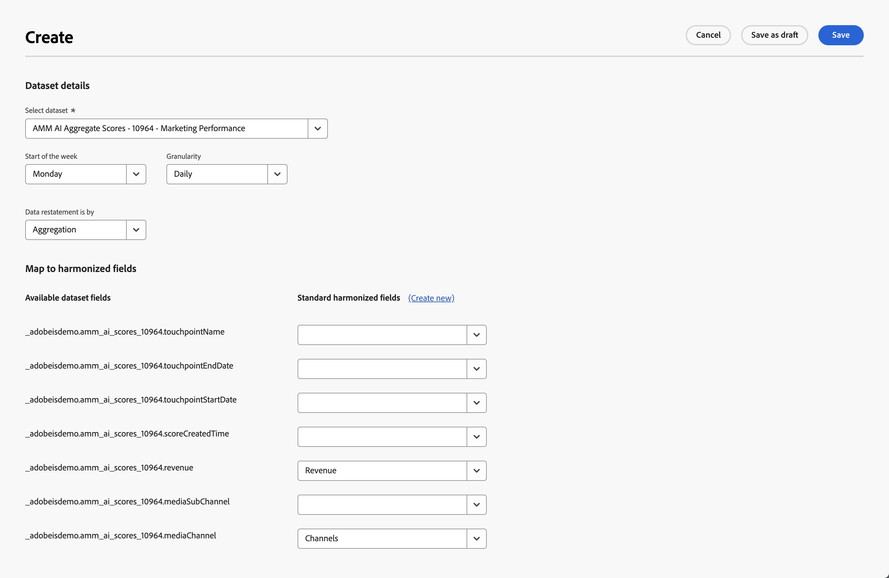
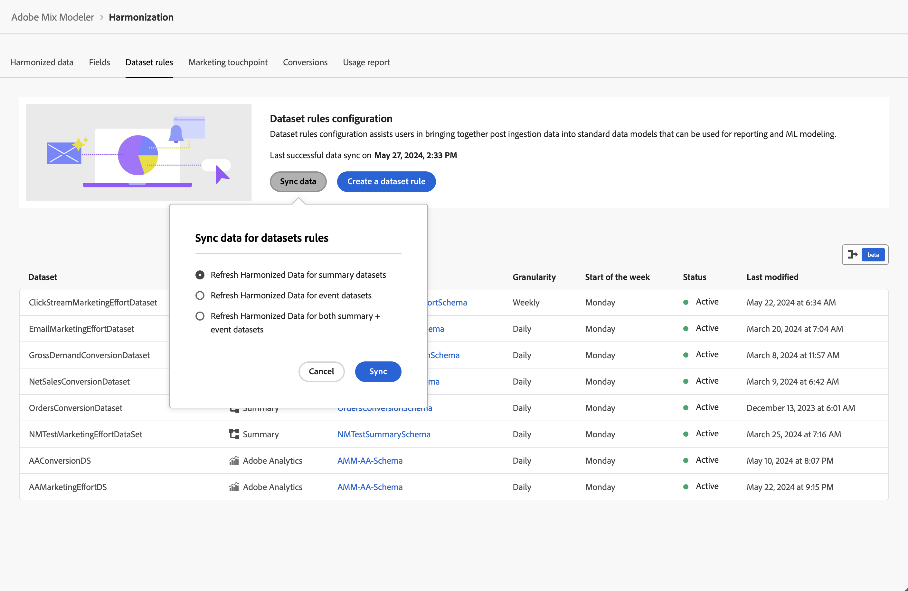
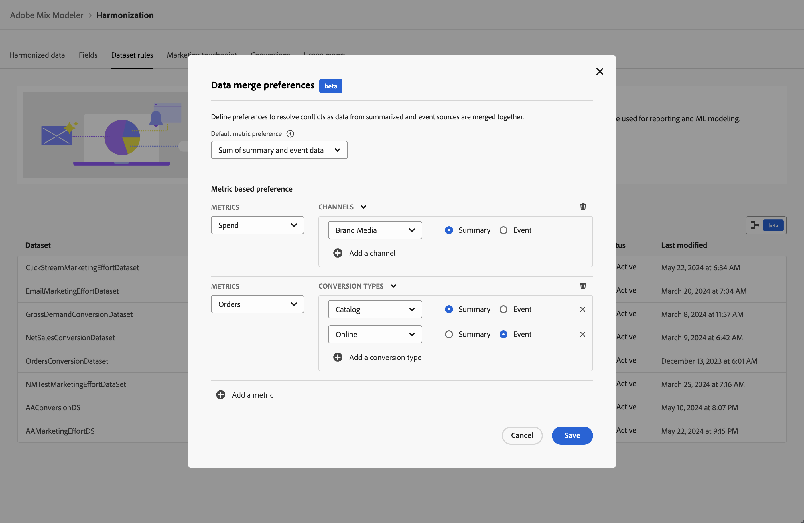

# Regole del set di dati

Le regole del set di dati ti aiutano a mappare i campi armonizzati con i campi dei dati acquisiti in Mix Modeler.

* Per i dati aggregati acquisiti in Adobe Experience Platform, mappi uno o più campi del set di dati disponibili ai campi armonizzati appropriati.
* Per i dati evento, puoi mappare singolarmente uno o più campi armonizzati ai campi del set di dati, direttamente o utilizzando le condizioni.

## Gestire le regole dei set di dati

Per visualizzare una tabella delle regole dei set di dati disponibili, nell’interfaccia Mix Modeler:

1. Seleziona  **[!UICONTROL Harmonized data]** dalla barra a sinistra.

1. Seleziona **[!UICONTROL Dataset rules]** dalla barra superiore. Viene visualizzata una tabella delle regole del set di dati.

Le colonne della tabella specificano i dettagli sulle regole del set di dati:

| Nome colonna | Dettagli |
| ---------------------- | ----------|
| Set di dati | Nome del set di dati. |
| Origine | L’origine del set di dati: Adobe Analytics, Eventi esperienza, Riepilogo (aggregato) o Eventi esperienza del consumatore. |
| Schema | Schema a cui è conforme il set di dati. Puoi selezionare rapidamente il nome dello schema per aprire lo schema in una nuova scheda nell’editor schema in  [Schemi](../ingest-data/schemas.md). |
| Granularità | Granularità dei dati nel set di dati. I valori possibili sono Giornaliero, Settimanale, Mensile o Annuale. |
| Inizio della settimana | Specifica quale giorno della settimana viene considerato come inizio di una nuova settimana per il set di dati specifico. |
| Stato | Stato del campo: 
● Bozza o 
● Attivo |
| Ultima modifica | Dati e ora dell’ultima modifica della regola del set di dati. |

{style="table-layout:auto"}

### Creare una regola del set di dati

Per creare una regola del set di dati, nella  **[!UICONTROL Harmonized data]** > **[!UICONTROL Dataset rules]** in Mix Modeler, seleziona **[!UICONTROL Create a dataset rule]** nel **[!UICONTROL Dataset rules configuration]** procedura guidata.

In **[!UICONTROL Create]** schermo,

1. In entrata **[!UICONTROL Dataset details]**, seleziona un set di dati da **[!UICONTROL Select dataset]** per iniziare la configurazione. Nell’elenco, i set di dati sono suddivisi in categorie **[!UICONTROL Consumer Experience Events]**, **[!UICONTROL Adobe Analytics]**, **[!UICONTROL Experience Event]** e **[!UICONTROL Summary]**.

1. Seleziona un giorno per **[!UICONTROL Start of the week]**.

1. Seleziona **[!UICONTROL Daily]**, **[!UICONTROL Weekly]**, **[!UICONTROL Monthly]** o **[!UICONTROL Yearly]** per **[!UICONTROL Granularity]**.

1. Quando hai selezionato un set di dati di **[!UICONTROL Summary]** categoria:

   1. Per definire se i dati per il set di dati aggregano o sostituiscono i dati esistenti, seleziona **[!UICONTROL Aggregation]** o **[!UICONTROL Replacement]** per **[!UICONTROL Data restatement is by]**.

   1. Mappa ciascuno dei **[!UICONTROL Available dataset fields]** corrispondente a **[!UICONTROL Standard harmonized fields]** in **[!UICONTROL Map to harmonized fields]**. Se non desideri mappare un campo set di dati su un campo armonizzato, seleziona esplicitamente **[!UICONTROL -- None --]**.

   1. Se hai bisogno di un nuovo campo armonizzato, non disponibile dall’elenco, seleziona **[!UICONTROL Create New]** creare un nuovo campo armonizzato. La finestra di dialogo viene visualizzata come descritto in [Aggiungi un nuovo campo armonizzato](fields.md#add-a-harmonized-field).

   1. Una volta completata la mappatura per tutti i campi della regola, seleziona **[!UICONTROL Save as draft]** per salvare una bozza di versione della regola oppure **[!UICONTROL Save]** per salvare e attivare la regola. Seleziona **[!UICONTROL Cancel]** per annullare la configurazione della regola.

      

1. Dopo aver selezionato un set di dati per la categoria dell’evento (**[!UICONTROL Experience Events]**, **[!UICONTROL Adobe Analytics]**, **[!UICONTROL Consumer Experience Events]**), nella casella sottostante **[!UICONTROL Map to harmonized fields]**:

   1. Seleziona un campo armonizzato da **[!UICONTROL Standard harmonized field]**.

   1. Quando il campo armonizzato selezionato è di tipo metrica:

      1. Seleziona **[!UICONTROL Count]** o **[!UICONTROL Sum]** da **[!UICONTROL Mapping type]**.

      1. Seleziona un **[!UICONTROL *Campo set di dati AEP *]**che desideri venga mappato al campo armonizzato per impostazione predefinita.

   1. Quando il campo selezionato è di tipo dimensione:

      1. Seleziona **[!UICONTROL Map Into]** o **[!UICONTROL Case]** da **[!UICONTROL Mapping type]**.

      1. Dopo aver selezionato **[!UICONTROL Map Into]**, seleziona **[!UICONTROL Field]** e **[!UICONTROL *Campo set di dati AEP *]**o **[!UICONTROL Value]**e un valore predefinito per mappare il campo armonizzato per impostazione predefinita al campo del set di dati o al valore immesso.

      1. Quando selezioni **[!UICONTROL Case]**, seleziona **[!UICONTROL Field]** e **[!UICONTROL *Campo set di dati AEP *]**o **[!UICONTROL Value]**e un valore predefinito per mappare il campo armonizzato per impostazione predefinita al campo del set di dati o al valore immesso.

         1. Per impostare i valori in modo esplicito, definite uno o più casi, costituiti da una o più condizioni. Ogni condizione può verificare la presenza di un **[!UICONTROL *Campo set di dati AEP *]**se **[!UICONTROL Exists]**o **[!UICONTROL Not Exists]**o se **[!UICONTROL Contains]**,**[!UICONTROL Not Contains]**,**[!UICONTROL Equals]**,**[!UICONTROL Not Equals]**,**[!UICONTROL Starts With]**, o **[!UICONTROL Ends With]**un valore immesso in corrispondenza di**[!UICONTROL * Immetti il valore di input *]**.

         1. Per aggiungere un altro caso, seleziona  **[!UICONTROL Add case]**, per aggiungere un&#39;altra condizione, seleziona  **[!UICONTROL Add condition]**.

         1. Per eliminare un caso o una condizione, seleziona  nel contenitore corrispondente.

         1. Per selezionare se una o tutte le condizioni devono essere applicate a un caso, seleziona **[!UICONTROL Any of]** o **[!UICONTROL All of]**.

         1. Per impostare il valore di risultato per un caso, immettere il valore in corrispondenza di **[!UICONTROL Then]**.

      L’esempio seguente

      * utilizza un **[!UICONTROL Map Into]** **[!UICONTROL Mapping type]** per mappare **[!UICONTROL Channel Type At Source]** campo armonizzato al **[!UICONTROL channel_type]** campo da **[!DNL Luma Transactions]** set di dati.

      * utilizza un **[!UICONTROL Case]** **[!UICONTROL Mapping type]** per mappare in modo condizionale il valore del **[!UICONTROL marketing.campaignName]** campo in **[!DNL Luma Transactions]** set di dati per **[!UICONTROL Campaign]** campo armonizzato. Il campo armonizzato di Campaign è impostato su:

         * `Black Friday` quando **[!UICONTROL marketing.campaignName]** è `_black_friday` o `BlackFriday`.
         * al valore del **[!UICONTROL marketing.campaignName]** in tutti gli altri casi

        

1. Seleziona  **[!UICONTROL Add field]** per definire campi aggiuntivi.

Al termine, seleziona **[!UICONTROL Save as draft]** per salvare una bozza di versione della regola oppure **[!UICONTROL Save]** per salvare e attivare la regola. Seleziona **[!UICONTROL Cancel]** per annullare la configurazione della regola.

### Modificare una regola del set di dati

Per modificare una regola del set di dati, nella  **[!UICONTROL Harmonized data]** > **[!UICONTROL Dataset rules]** interfaccia in Mix Modeler:

1. Seleziona  nel **[!UICONTROL Dataset]** per la regola del set di dati da modificare.
1. Dal menu di scelta rapida, selezionare  **[!UICONTROL Edit]** per iniziare a modificare la regola del set di dati. Fai riferimento a [Creare una regola del set di dati](#create-a-dataset-rule) per ulteriori dettagli.

### Eliminare una regola di set di dati

Per eliminare una regola di set di dati, nella  **[!UICONTROL Harmonized data]** > **[!UICONTROL Dataset rules]** interfaccia in Mix Modeler:

1. Seleziona  nel **[!UICONTROL Dataset]** per la regola del set di dati da eliminare.
1. Dal menu di scelta rapida, selezionare  **[!UICONTROL Delete]** per eliminare la regola del set di dati. Viene richiesta una conferma. Seleziona **[!UICONTROL Delete]** per eliminare definitivamente la regola del set di dati selezionato.

## Sincronizza dati

Per sincronizzare i dati tra i dati armonizzati e i set di dati di riepilogo e/o evento, segui tutte le logiche delle regole dei set di dati:

1. Seleziona **[!UICONTROL Sync data]**.

1. Dalla sezione **[!UICONTROL Sync data for dataset rules]** finestra di dialogo, seleziona
   * **[!UICONTROL Refresh harmonized data for summary datasets]**,
   * **[!UICONTROL Refresh harmonized data for event datasets]**, o
   * **[!UICONTROL Refresh harmonized data for both summary + event datasets]**.

1. Per avviare la sincronizzazione in base alle regole definite del set di dati tra dati armonizzati e dati nei set di dati, seleziona **[!UICONTROL Sync]**. Per annullare la sincronizzazione, selezionare **[!UICONTROL Cancel]**.

   

## Preferenze di unione dati

>[!NOTE]
>
>[!BADGE beta]{type=Informative}

Le preferenze di unione dati consentono di risolvere i conflitti quando si uniscono dati provenienti da origini dati riepilogate ed eventi. I casi di utilizzo sono:

* la stessa metrica pubblicitaria è misurata e segnalata in più set di dati, oppure
* la misurazione delle metriche può essere incompleta in alcuni set di dati, mentre un altro set di dati può essere un superset di una particolare metrica, con conseguente doppio conteggio.

Per garantire previsioni accurate dei modelli, puoi definire le preferenze di unione dei dati:

1. Seleziona  [!BADGE beta].

1. In **[!UICONTROL Data merge preferences]** [!BADGE beta]{type=Informative}

   

   * Seleziona un **[!UICONTROL Default metric preference]**. La preferenza metrica predefinita selezionata viene applicata quando, durante l’armonizzazione, più origini di dati aggiornano un campo metrico per un determinato canale. La preferenza viene applicata a livello di sandbox, a meno che non venga bypassata per specifiche preferenze basate su metriche. Puoi scegliere tra **[!UICONTROL Summary data]**, **[!UICONTROL Event data]** e **[!UICONTROL Sum of summmary and event data]**.

   * Per aggiungere preferenze specifiche basate su metriche:

      1. Seleziona  **[!UICONTROL Add a metric]**.
         1. Seleziona una metrica da **[!UICONTROL *Selezione delle metriche *]**elenco.
         1. Seleziona **[!UICONTROL CHANNELS]** o **[!UICONTROL CONVERSION TYPES]**. Dall’elenco, seleziona **[!UICONTROL All]** o un tipo di canale o conversione specifico.
         1. Seleziona **[!UICONTROL Summary]** o **[!UICONTROL Event]** per specificare se i dati di riepilogo o i dati evento sono preferiti per la metrica (e per tutti o per il canale selezionato) durante l’unione dei dati.

         Per aggiungere uno o più tipi di canale o conversione aggiuntivi:

         1. Seleziona  **[!UICONTROL Add a channel]** o  **[!UICONTROL Add a conversion type]**.
         1. Seleziona **[!UICONTROL Summary]** (Mostra origine dati) o **[!UICONTROL Event]** (Blocca selezione).

         Per eliminare un canale o un tipo di conversione, seleziona .

      1. Per aggiungere preferenze più specifiche basate su metriche, ripeti il passaggio precedente.

   * Per eliminare una specifica preferenza basata su metriche, seleziona .

1. Seleziona **[!UICONTROL Save]** per salvare le preferenze di unione dati. È stata avviata una risincronizzazione dei dati.  Seleziona **[!UICONTROL Cancel]** per annullare.

## Controllo dell’accesso a livello di campo

Durante la configurazione delle regole del set di dati per i set di dati armonizzati, Experienci Platform [controllo degli accessi basato su attributi](https://experienceleague.adobe.com/en/docs/experience-platform/access-control/abac/overview) viene applicato a livello di campo. Un campo è limitato quando un’etichetta viene associata a un campo schema e viene abilitato un criterio attivo che nega l’accesso a tale campo. Di conseguenza:

* quando crei una regola di set di dati, non vengono visualizzati i campi dello schema con restrizioni,
* non puoi visualizzare o modificare la mappatura di uno o più campi dello schema per i quali esistono restrizioni. Quando modifichi o visualizzi una regola del set di dati contenente tali campi con restrizioni, viene visualizzata la schermata seguente.
  
