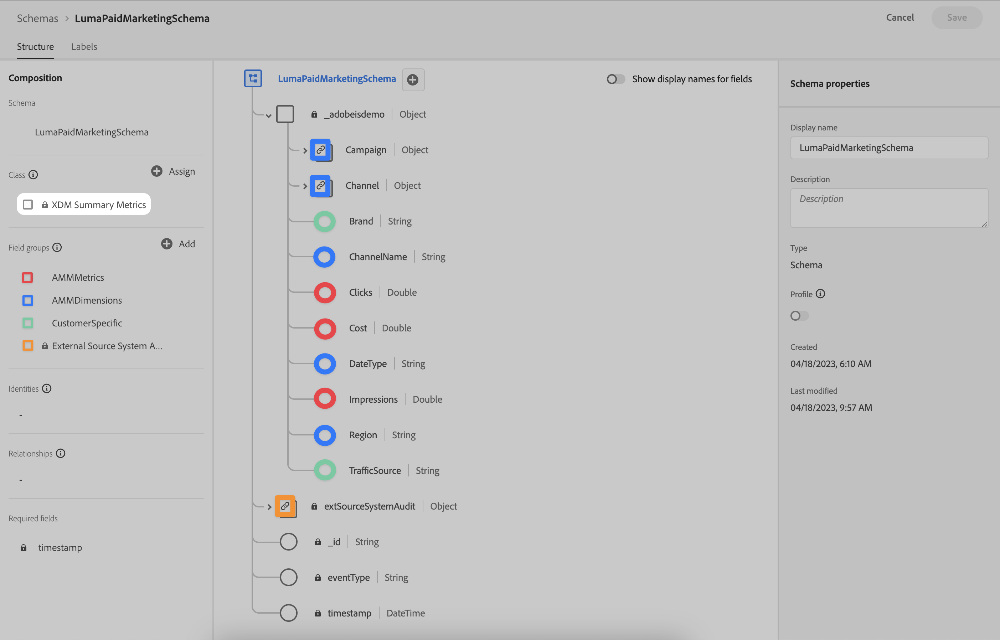

# Schemi

Per gestire gli schemi, supportare i dati da acquisire in Adobe Experience Platform e utilizzare in Adobe Mix Modeler:

1. Passa all&#39;interfaccia di Adobe Mix Modeler.

1. Seleziona  **[!UICONTROL Schemas]**, sotto **[!UICONTROL DATA MANAGEMENT]**.

Consulta la [Panoramica dell’interfaccia utente degli schemi](https://experienceleague.adobe.com/docs/experience-platform/xdm/ui/overview.html?lang=en) per ulteriori informazioni.

## Dati aggregati o di riepilogo

Si consiglia vivamente di utilizzare la classe Metriche di riepilogo XDM come base dello schema sottostante qualsiasi dato aggregato o di riepilogo che si desidera acquisire in Experienci Platform e utilizzare in Adobe Mix Modeler.

Vedi di seguito per un esempio di **[!DNL LumaPaidMarketingSchema]** utilizzo delle metriche di riepilogo XDM come classe base e gruppi di campi dedicati (con annotazioni di colori) per la metrica (**[!DNL AMMMetrics]**), dimensioni (**[!DNL AMMDimensions]**) e altre informazioni specifiche per il cliente (**[!DNL CustomerSpecific]**).

Per definire un set di proprietà di controllo, si consiglia vivamente di utilizzare il gruppo di campi Dettagli controllo sistema di origine esterna come parte di uno schema utilizzato per la raccolta di dati aggregati o di riepilogo da origini esterne.
