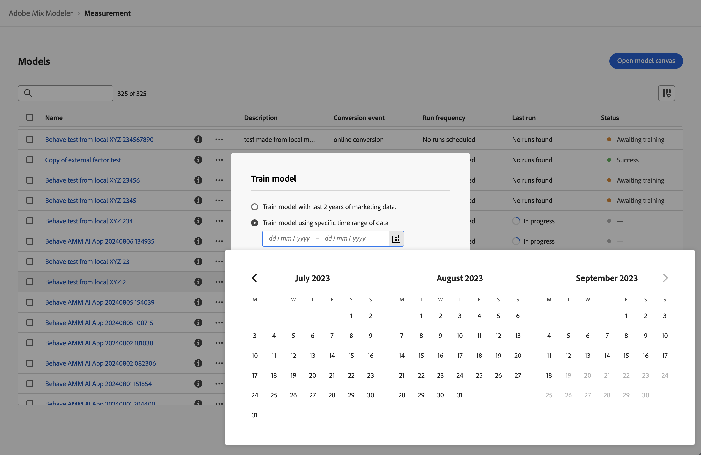

# Formazione e valutazione dei modelli

Dopo aver [generato](/help/models/build.md) un modello, questo viene automaticamente addestrato e valutato. Potete riaddestrare o ripristinare manualmente un modello.

## Addestra

È consigliabile riqualificare un modello quando si desidera includere nuovi dati di marketing e di fattore incrementali. Ad esempio, nell’ultimo trimestre, le dinamiche di mercato sono cambiate o la distribuzione dei dati di marketing è cambiata in modo significativo.

Per riaddestrare un modello:

1. Seleziona  **[!UICONTROL Models]** dalla barra a sinistra.

1. Seleziona  per un modello e dal menu di scelta rapida seleziona **[!UICONTROL Train]**. In alternativa, selezionare  **[!UICONTROL Train]** dalla barra delle azioni blu.

   Nella finestra di dialogo **[!UICONTROL Train model]**, seleziona l&#39;opzione per:

   * **[!UICONTROL Train model with last 2 years of marketing data]**, oppure
   * **[!UICONTROL Train model using specific date range of data]**.
Specifica l’intervallo di date. È possibile utilizzare il  per selezionare un intervallo di date. Devi selezionare un intervallo di dati con un minimo di un anno.

   

1. Selezionare **[!UICONTROL Train]** per riaddestrare il modello.

È possibile riaddestrare un modello solo quando il modello è stato addestrato correttamente.

## Punteggio

Puoi assegnare un punteggio incrementale a un modello in base a nuovi dati di marketing o ripristinare un modello per un intervallo di date specifico.

Considera il ripristino di un modello quando desideri:

* Correggere i dati di marketing errati. Ad esempio, i dati recenti relativi alla ricerca a pagamento inclusi nell’addestramento e nel punteggio del modello non hanno riportato una settimana di dati.
* Utilizza i nuovi dati di marketing incrementali resi disponibili tramite aggiornamenti nei set di dati configurati come parte dei dati armonizzati.

Per assegnare un punteggio o ripristinare un modello:

1. Seleziona  **[!UICONTROL Models]** dalla barra a sinistra.

1. Seleziona  per un modello e dal menu di scelta rapida seleziona **[!UICONTROL Score]**. In alternativa, selezionare  **[!UICONTROL Score]** dalla barra delle azioni blu.

   Nella finestra di dialogo **[!UICONTROL Score marketing data]**, seleziona l&#39;opzione per:

   * **[!UICONTROL Score new marketing data from *mm/gg/aaaa *]**, per valutare il modello in modo incrementale utilizzando nuovi dati di marketing, oppure
   * **[!UICONTROL Score specific date range of marketing data]** per ripristinare per un intervallo di date specifico.
Specifica l’intervallo di date. È possibile utilizzare il  per selezionare un intervallo di date.

   

1. Selezionare **[!UICONTROL Score]**. Quando si assegna un nuovo punteggio a un modello utilizzando un intervallo di dati specifico, viene visualizzata una finestra di dialogo **[!UICONTROL Existing model is replaced]** in cui viene richiesto di confermare la sostituzione del modello con nuovi punteggi per l’intervallo di date selezionato. Selezionare **[!UICONTROL Replace model]** per confermare.

>[!IMPORTANT]
>
>Il recore di un modello non modifica i piani già creati in base al modello con nuovo punteggio. Per utilizzare il nuovo modello con ricalcolo in un piano, è necessario creare un nuovo piano.

