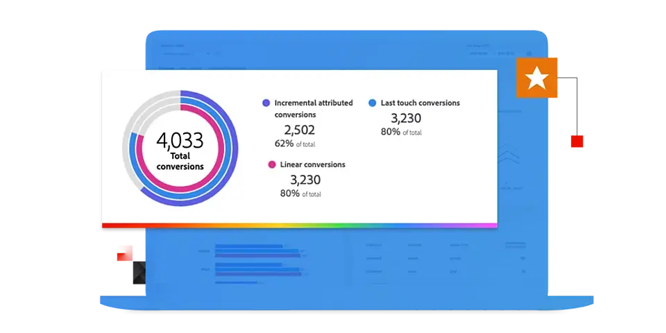

# Guida di Adobe Mix Modeler

Questa guida alla documentazione tecnica fornisce supporto autonomo per Adobe **Mix Modeler**. Mix Modeler è un’applicazione Adobe Experience Cloud che misura le campagne e ottimizza la pianificazione olistica su tutti i canali: a pagamento, guadagnato e di proprietà. Mix Modeler è basato su Adobe Experience Platform e viene fornito con tecnologia Adobe Sensei.

## Inizia con le nozioni di base

<table style="table-layout:fixed">
  <tr style="border: 0;">
    <td>
    
    
<strong>Guida rapida</strong> Ottieni una panoramica di e di insight nel flusso di lavoro di Mix Modeler.

    </td>
    <td>
    
    
<strong>Acquisire dati</strong> Scopri come acquisire in Mix Modeler dati di eventi e dati aggregati o di riepilogo.

    </td>
    <td>
    
    
<strong>Armonizzare i dati</strong> Scopri come assimilare i dati aggregati ed eventi in una visualizzazione dati coerente. 
    

    </td>
    <td>
    
    
<strong>Modello e piano</strong> Formazione e valutazione dei modelli e utilizzo delle informazioni per i piani di marketing.

    </td>
  </tr>
  <tr style="border: 0;">
    <td align="center"></td>
    <td align="center"></td>
    <td align="center"></td>
    <td align="center"></td>
    </tr>
</table>

## Esplora la documentazione

<table style="table-layout:fixed">
  <tr style="border: 0;">
    <td>
       
      <strong>Acquisire dati</strong> <a href="/help/ingest-data/overview.md">Panoramica</a> - <a href="/help/ingest-data/schemas.md">Schemi</a> - <a href="/help/ingest-data/datasets.md">Set di dati</a> 
    </td>
    <td>
       
      <strong>Armonizza dati</strong> <a href="/help/harmonize-data/overview.md">Panoramica</a> - <a href="/help/harmonize-data/fields.md">Campi</a> - <a href="/help/harmonize-data/dataset-rules.md">Regole set di dati</a> - <a href="/help/harmonize-data/marketing-touchpoints.md">Punti di contatto marketing</a> - <a href="/help/harmonize-data/conversions.md">Conversioni</a> - <a href="/help/harmonize-data/usage-report.md">Rapporto utilizzo</a>  
    </td>
    <td>
       
      <strong>Modelli</strong> <a href="/help/models/overview.md">Panoramica</a> - <a href="/help/models/build.md">Modelli di compilazione</a> - <a href="/help/models/insights.md">Informazioni sul modello</a> - <a href="/help/models/scoring-data.md">Utilizza dati di punteggio</a>
    </td>
  </tr>
  <tr style="border: 0;">
    <td>
       
      <strong>Piani</strong> <a href="/help/plans/overview.md">Piani</a> - <a href="/help/plans/build.md">Piani di compilazione</a> - <a href="/help/plans/compare.md">Confronta piani</a> - <a href="/help/plans/build.md">Approfondimenti piano</a>
    </td>
    <td>
       
      <strong>Panoramica</strong> <a href="/help/dashboard/overview.md">Schemi</a> - <a href="/help/dashboard/harmonized-data.md">Dati armonizzati</a> - <a href="/help/dashboard/plans.md">Piani</a>
    </td>
        <td>
       
      <strong>Tutorial</strong> <a href="https://experienceleague.adobe.com/docs/mix-modeler-learn/tutorials/overview.html?lang=en">Panoramica</a> - <a href="https://experienceleague.adobe.com/docs/mix-modeler-learn/tutorials/intro/use-cases.html?lang=en">Casi d'uso</a> - <a href="https://experienceleague.adobe.com/docs/mix-modeler-learn/tutorials/intro/user-workflow.html?lang=en">Flusso di lavoro utente</a> - <a href="https://experienceleague.adobe.com/docs/mix-modeler-learn/tutorials/intro/user-interface-tour.html?lang=en">Presentazione dell'interfaccia utente</a>
    </td>
  </tr>
</table>

